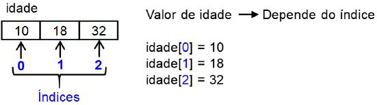
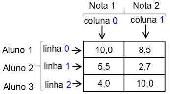
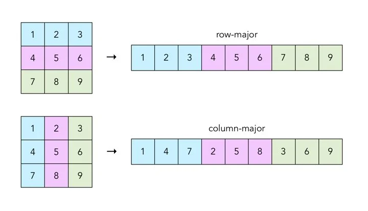
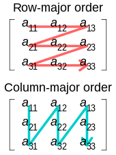
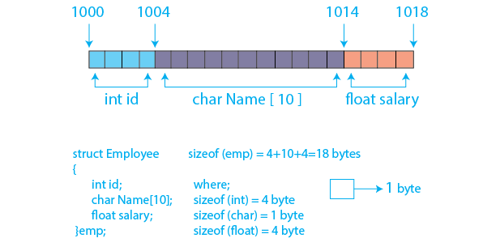
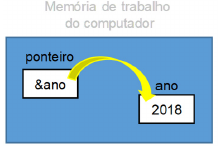

# Algoritmos e Programação Estruturada

APE-U1S2

Este Notebook usa o **Jupyter C kernel**: https://github.com/XaverKlemenschits/jupyter-c-kernel

No Colab usar o CAD4U: https://colab.research.google.com/drive/1YgB_zCS7VY9hF8Zs1Du5YUyF5z7sEX0w

## Componentes e elementos de linguagem de programação

- Uma varriável é uma posição na memória onde um valor pode ser armazenado para ser utilizado por um programa.
- O espaço de memória alocado depende do tipo de variável.
- O espaço também pode ser especificado pelo programador, usando funções específicas.
- Tipos primitivos em C: int, float, double, char, void, _Bool


```text/x-csrc
int main() {
    int     idade, Idade;      // cuidado com maiúsculas/minúsculas
    float   salario     = 7500;  
    double  qtd_atomos;
    _Bool   confirma    = 0;   // tentar usar nomes completos
    char    genero[]    = "";  // inicializado com "vazio"
}
```

    /tmp/tmp_cccobgc.c: In function ‘main’:
    /tmp/tmp_cccobgc.c:6:13: warning: unused variable ‘genero’ [-Wunused-variable]
        6 |     char    genero[]    = "";  // inicializado com "vazio"
          |             ^~~~~~
    /tmp/tmp_cccobgc.c:5:13: warning: unused variable ‘confirma’ [-Wunused-variable]
        5 |     _Bool   confirma    = 0;   // tentar usar nomes completos
          |             ^~~~~~~~
    /tmp/tmp_cccobgc.c:4:13: warning: unused variable ‘qtd_atomos’ [-Wunused-variable]
        4 |     double  qtd_atomos;
          |             ^~~~~~~~~~
    /tmp/tmp_cccobgc.c:3:13: warning: unused variable ‘salario’ [-Wunused-variable]
        3 |     float   salario     = 7500;
          |             ^~~~~~~
    /tmp/tmp_cccobgc.c:2:20: warning: unused variable ‘Idade’ [-Wunused-variable]
        2 |     int     idade, Idade;      // cuidado com maiúsculas/minúsculas
          |                    ^~~~~
    /tmp/tmp_cccobgc.c:2:13: warning: unused variable ‘idade’ [-Wunused-variable]
        2 |     int     idade, Idade;      // cuidado com maiúsculas/minúsculas
          |             ^~~~~


- É uma boa prática de programação sempre inicializar as variáveis.
    - Evita receber dados "lixo" que já estavam na memória.
    - Pode ajudar na depuração.

| Tipo | Bytes |
|---|---|
| char | 1 |
| int | 4 |
| float | 4 |
| double | 8 |
| _Bool | 1 |
| unsigned int | 4 |
| unsigned int | 2 |
| long double | 16 |


```text/x-csrc
#include <stdio.h>

int main(){

    short int idade = 18;
    float salario = 7500;
    double qtd_atomos = 123456789123;
    char genero[] = "F";
    float altura = 1.63;

    printf("\n idade: %d",idade);
    printf("\n salario: %f",salario);
    printf("\n qtd_atomos: %f",qtd_atomos);
    printf("\n genero: %c",genero);
    printf("\n altura: %.3f",altura);
}
```

    
     idade: 18
     salario: 7500.000000
     qtd_atomos: 123456789123.000000
     genero: V
     altura: 1.630

## Constantes


```text/x-csrc
#include<stdio.h>

#define pi 3.14

int main(){

    const float g = 9.8;

    printf("pi = %f\n", pi);
    printf("g = %f\n", g);
}
```

    pi = 3.140000
    g = 9.800000


## Endereço de uma variável (operador `&`)


```text/x-csrc
#include<stdio.h>

int main(){

    const float g = 9.8;

    printf("&g = %x (hexa)\n", &g);
}
```

    &g = 7d73e9e4 (hexa)


```text/x-csrc
#include<stdio.h>

int main(){

    float valor = 0;

    printf("Digite o primeiro valor:");

    scanf("%f", &valor);  // exemplo do uso do "&" (endereço de)

    printf("Variavel = %.2f", valor);
}
```

    Digite o primeiro valor:

     12.34


    Variavel = 12.34

## Variáveis compostas

- Formadas a partir dos tipos primitivos.
- Podem ser indexadas. Ex.: a[0].
- Unidimensionais: "vetores" ou "matrizes unidimensionais"


```text/x-csrc
#include <stdio.h>

int main(){

    int idade[3] = {10, 18, 32};

    printf("idade[0] = %d\n", idade[0]);
    printf("idade[1] = %d\n", idade[1]);
    printf("idade[2] = %d\n", idade[2]);
}
```

    idade[0] = 10
    idade[1] = 18
    idade[2] = 32




## String

- apóstrofo delimita caracter
- aspas delimita string


```text/x-csrc
#include <stdio.h>

int main(){
    char nome[11] = "1234567890"; // é sempre 1 a mais, devido ao "\0"
    char nome2[16] = {'J','o','a','o','\0'};

    printf("%s, %s\n", nome, nome2);
}
```

    1234567890, Joao


## Variáveis compostas homogêneas bidimensionais (matrizes)

|  Dia   |  Temperatura (°C) |
|---|---|                   
|    1   |  26,1            |
|    2   |  27,7            |
|    3   |  30,0            |
|    4   |  32,3            |
|    5   |  27,6            |
|    6   |  29,5            |
|    7   |  29,9            |


```text/x-csrc
#include <stdio.h>

int main(){
    float temperaturas[7][2];

    temperaturas[0][0] = 1 ;
    temperaturas[0][1] = 26.1 ;

    temperaturas[1][0] = 2 ;
    temperaturas[1][1] = 27.7 ;

    temperaturas[2][0] = 3 ;
    temperaturas[2][1] = 30.0 ;

    temperaturas[3][0] = 4 ;
    temperaturas[3][1] = 32.3 ;

    temperaturas[4][0] = 5 ;
    temperaturas[4][1] = 27.6 ;

    temperaturas[5][0] = 6 ;
    temperaturas[5][1] = 29.5 ;

    temperaturas[6][0] = 7 ;
    temperaturas[6][1] = 29.9 ;

    printf("%f, %f\n", temperaturas[0][0], temperaturas[0][1]);
}
```

    1.000000, 26.100000





```text/x-csrc
#include <stdio.h>

int main(){
    float notas[3][2] ;

    //aluno 1
    notas[0][0] = 10 ;
    notas[0][1] = 8.5 ;
    
    //aluno 2
    notas[1][0] = 5.5 ;
    notas[1][1] = 2.7 ;
    
    //aluno 3
    notas[2][0] = 4 ;
    notas[2][1] = 10 ;

    printf("%f, %f\n", notas[0][0], notas[0][1]);
}
```

    10.000000, 8.500000


## Ordem principal de linha e de coluna

- Importante para acesso usando a memória cache da CPU.
- Em memórias flash NAND, o acesso sequencial é mais rápido.
- O acesso contíguo possibilita o uso de instruções SIMD que operam sobre vetores de dados.





| row-major | column-major |
| --- | --- |
| C, C++, Python, Pascal | Fortran, Julia, R |

## Variáveis compostas heterogêneas (structs)




```text/x-csrc
#include <stdio.h>

struct Employee {
    int id;
    char name[10];
    float salary;
} emp;

int main(){
    emp.id = 1;
    strcpy(emp.name, "Jose");
    emp.salary = 2500;

    printf("%d, %s, %f\n", emp.id, emp.name, emp.salary);
}
```

    1, Jose, 2500.000000


## Variável do tipo ponteiro

  

| símbolo | significado |
| --- | --- |
| & | endereço de memória ("endereço") |
| * | conteúdo do endereço de memória ("conteúdo") |


```text/x-csrc
#include <stdio.h>

int main(){
    int ano = 2018;
    int *ponteiro_para_ano = &ano;  // declara um ponteiro

    printf("Endereço do ponteiro em si: %p\n", &ponteiro_para_ano);
    printf("Endereço que está armazenado no ponteiro: %p\n", ponteiro_para_ano);
    printf("Conteúdo da memória apontada pelo ponteiro: %d\n", *ponteiro_para_ano);
}
```

    Endereço do ponteiro em si: 0x7ffc263a2d60
    Endereço que está armazenado no ponteiro: 0x7ffc263a2d5c
    Conteúdo da memória apontada pelo ponteiro: 2018

