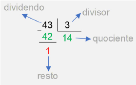
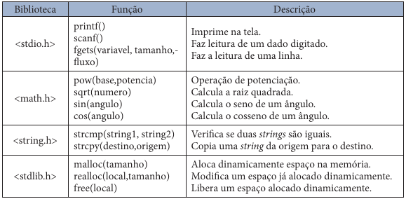

# Algoritmos e Programação Estruturada

APE-U1S3

## Operadores aritméticos em linguagens de programação

| Operador  |   Descrição   | Exemplo | Resultado |
|---|---|---|---|
|    +      |     Soma      |   4+2   |    6      |
|           |               |         |           |
|    -      |   Subtração   |   4–2   |    2      |
|           |               |         |           |
|    *      | Multiplicação |   4*2   |    8      |
|           |               |         |           |
|    /      |    Divisão    |   4/2   |    2      |
|           |               |         |           |
|    =      |  Atribuição   |   x=4   |   x=4     |
|           |               |         |           |
|    %      |    Módulo     |  4%2    |    0      |


```text/x-csrc
#include <stdio.h>

int main(){
    int idade1 = 0;
    int idade2 = 0;
    int resultado = 0;

    printf("Digite a primeira idade: ");
    scanf("%d", &idade1);

    printf("Digite a segunda idade: ");
    scanf("%d", &idade2);

    resultado = idade1 + idade2;

    printf("Resultado = %d", resultado);
}
```

    Digite a primeira idade: 

     10


    Digite a segunda idade: 

     20


    Resultado = 30

## Precedência de operadores

1. Parênteses.
2. Potenciação e radiciação.
3. Multiplicação, divisão e módulo.
4. Soma e subtração.

## Módulo




```text/x-csrc
#include <stdio.h>
int main(){
    int resultado = 43%3;
    printf("Operacao modulo 43%3 = %d",resultado);
}
```

    Operacao modulo 43%3 = 1

## Operadores aritméticos de incremento e decremento


```text/x-csrc
#include <stdio.h>
int main(){
    int a, b;
    a = 5;
    b = ++a;
    printf("%d, %d\n", a, b);

    a = 5;
    b = --a;
    printf("%d, %d\n", a, b);
    
    a = 5;
    b = a++;
    printf("%d, %d\n", a, b);

    a = 5;
    b = a--;
    printf("%d, %d\n", a, b);
}
```

    6, 6
    4, 4
    6, 5
    4, 5


| Operador | Operação | Retorna o valor |
|---|---| ---|
| ++a | incrementa a variável | incrementado |
| --a | decrementa a variável | decrementado |
| a++ | incrementa a variável | original antes da operação de incremento |
| a-- | decrementa a variável | original antes da operação de decremento |

## Operadores relacionais em linguagens de programação


```text/x-csrc
#include <stdio.h>
int main(){
    _Bool a, b, c, d, e, f;
    a = 1 == 2;
    b = 1 != 2;
    c = 1 > 2;
    d = 1 < 2;
    e = 1 >= 2;
    f = 1 <= 2;

    printf("%d, %d, %d, %d, %d, %d\n", a, b, c, d, e, f);
}
```

    0, 1, 0, 1, 0, 1


## Operadores lógicos em linguagens de programação


```text/x-csrc
#include <stdio.h>
int main(){
    _Bool a, b, c;
    a = ! 1;     // não
    b = 1 && 0;  // e
    c = 1 || 0;  // ou

    printf("%d, %d, %d\n", a, b, c);
}
```

    0, 0, 1


## Funções predefinidas para linguagem de programação



## strcmp()


```text/x-csrc
#include <stdio.h>
#include <string.h>
int main(){
    char a[] = "Laranja";
    char b[] = "Abacaxi";
    printf("%d, %d, %d, %d\n", strcmp(a, b), a[0], b[0], a[0]-b[0]);
}
```

    11, 76, 65, 11


```text/x-csrc
#include <stdio.h>
#include <string.h>
int main(){
    char a[] = "Abacaxi";
    char b[] = "Laranja";
    printf("%d\n", strcmp(a, b));
}
```

    -11


```text/x-csrc
#include <stdio.h>
#include <string.h>
int main(){
    char a[] = "AbacaxiA";
    char b[] = "Abacaxi";
    printf("%d\n", strcmp(a, b));
}
```

    65


```text/x-csrc
#include <stdio.h>
#include <string.h>
int main(){
    char a[] = "Abacaxi";
    char b[] = "Abacaxi";
    printf("%d\n", strcmp(a, b));
}
```

    0


## sizeof()

- No caso de string, retorna o total alocado, e não o tamanho da string.


```text/x-csrc
#include <stdio.h>
int main(){
    int a = 0;
    float b = 3.14;
    char c[100] = "Abacaxi";

    printf("%d, %d, %d\n", sizeof(a), sizeof(b), sizeof(c));
}
```

    4, 4, 100


```text/x-csrc
#include <stdio.h>
int main(){
    printf("%d, %d, %d\n", sizeof(int), sizeof(float), sizeof(char));
}
```

    4, 4, 1


## malloc()

- Alocação dinâmica de memória.


```text/x-csrc
#include <stdio.h>
#include <stdlib.h>

int main () {
   char *str;
   str = (char *) malloc(15);  // ponteiro para char

   strcpy(str, "Laranja");

   printf("String = %s,  Address = %p\n", str, str);

   free(str);
}
```

    String = Laranja,  Address = 0x55802c2b2890

