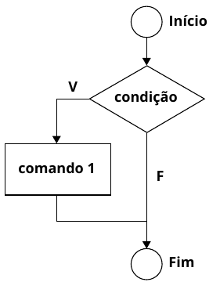
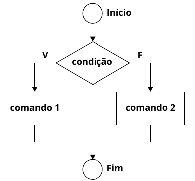

# Algoritmos e Programação Estruturada

APE-U2S1

## Estruturas de decisão e seleção




```text/x-csrc
#include <stdio.h>

int main(){
    float idade;

    printf("Digite sua idade:\n");
    scanf("%f", &idade);

    if(idade>=18){
        printf("Voce ja pode tirar sua carteira de habilitacao");
    }
}
```

    Digite sua idade:


     18


    Voce ja pode tirar sua carteira de habilitacao

## Estrutura condicional composta




```text/x-csrc
#include <stdio.h>

int main() {
    float orcamento;

    printf("Digite o valor do orcamento para viagem\n");
    scanf("%f", & orcamento);

    if (orcamento >= 10000) {
        printf("Joao e maria possuem orçamento para uma viagem" 
            "internacional, pois seu orcamento e de %f\n", orcamento);
    } else {
        printf("Joao e Maria irão optar por uma viagem nacional, "
            "seu orçamento ficou em %f\n", orcamento);
    }
}
```

    Digite o valor do orcamento para viagem


     20000


    Joao e maria possuem orçamento para uma viageminternacional, pois seu orcamento e de 20000.000000


```text/x-csrc
#include <stdio.h>
#include <stdlib.h>
int main() {
    int num;
    
    printf ("Digite um numero: ");
    scanf ("%d", &num);
    
    if (num>0){
        printf ("O número é positivo\n");
    } else {
        printf ("O número é negativo");
    }
}
```

    Digite um numero: 

     10


    O número é positivo


## switch-case


```text/x-csrc
#include <stdio.h>
 
int main(){
  // switch variable
    int var = 1;
 
  // switch statement
    switch (var) {
        case 1:
            printf("Case 1 is Matched.");
            break;
 
        case 2:
            printf("Case 2 is Matched.");
            break;
 
        case 3:
            printf("Case 3 is Matched.");
            break;
 
        default:
            printf("Default case is Matched.");
            break;
    }
}
```

    Case 1 is Matched.

## if aninhado


```text/x-csrc
#include <stdio.h>

int main() {
    int a = 10, b = 10, c = 10;

    if (a < b + c && b < a + c && c < a + b) {
        printf("Dadas as medidas: %d, %d, %d, "
               "temos um triangulo.\n", a, b, c);

        if (a == b && a == c) {
            printf("Este é um triangulo EQUILATERO! \n");

        } else if (a == b || a == c || b == c) {
            printf("Este é um triangulo ISOSCELES!\n");

        } else {
            printf("Este é um triangulo ESCALENO!\n");
        }

    } else {
        printf("As medidas fornecidas %d,%d,%d nao formam um "
            "triangulo", a, b, c);
    }
}
```

    Dadas as medidas: 10, 10, 10, temos um triangulo.
    Este é um triangulo EQUILATERO! 

