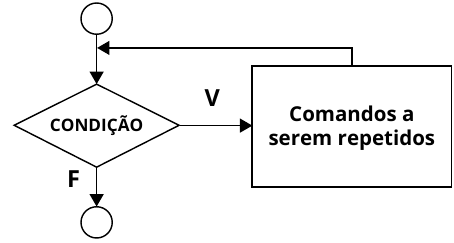
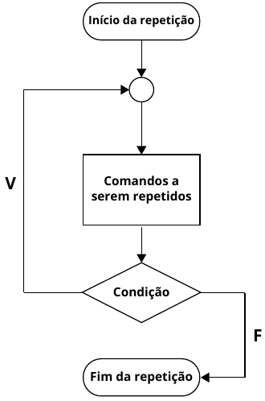

# Algoritmos e Programação Estruturada

APE-U2S2

## while




```text/x-csrc
#include <stdio.h>

int main() {
    int cont = 1;

    while (cont < 11) {
        printf("%2d  %2d  %2d  %2d  %2d\n",
               cont, cont*2, cont*3, cont*4, cont*5);
        cont++;
    }

}
```

     1   2   3   4   5
     2   4   6   8  10
     3   6   9  12  15
     4   8  12  16  20
     5  10  15  20  25
     6  12  18  24  30
     7  14  21  28  35
     8  16  24  32  40
     9  18  27  36  45
    10  20  30  40  50


Exemplo de uso do `while` para limpar o *buffer* de entrada quando existe algo digitado de forma incorreta. Vamos supor que foi digitado "10 20 30" no lugar de somente "10":


```text/x-csrc
#include <stdio.h>

int main() {
    int NUM, c;

    printf("\nDigite um Numero: ");
    scanf("%d", & NUM);
    printf("Número digitado: %d\n", NUM);

    printf("Limpeza do buffer: ");
    while ( ( c = getchar() ) != '\n' && c != EOF ){
       printf("'%c', ", c);
    }
    printf("\n");

    if (NUM >= 10 && NUM <= 50) {
        printf("O número está entre 10 e 50.\n");
    } else {
        printf("O número não está entre 10 e 50.\n");
    }
}
```

    
    Digite um Numero: 

     10 20 30


    Número digitado: 10
    Limpeza do buffer: ' ', '2', '0', ' ', '3', '0', 
    O número está entre 10 e 50.


## do-while



Exemplo

- Cálculo de metros quadrados.
- O programa fica repetindo os cálculos.
- Para sair, entra 0 (zero) nas duas perguntas.


```text/x-csrc
#include <stdio.h>

int main() {
    float metragem1 = 0, metragem2 = 0, resultado = 0;

    do {
        printf("CALCULO DE METROS QUADRADOS\n");
        printf("Digite a primeira metragem do terreno: ");
        scanf("%f", & metragem1);
        printf("Digite a segunda metragem do terreno: ");
        scanf("%f", & metragem2);
        resultado = (metragem1 * metragem2);
        printf("O terreno tem = %.2f m²\n\n", resultado);
    } while (resultado != 0);
}
```

    CALCULO DE METROS QUADRADOS
    Digite a primeira metragem do terreno: 

     10


    Digite a segunda metragem do terreno: 

     20


    O terreno tem = 200.00 m²
    
    CALCULO DE METROS QUADRADOS
    Digite a primeira metragem do terreno: 

     30


    Digite a segunda metragem do terreno: 

     40


    O terreno tem = 1200.00 m²
    
    CALCULO DE METROS QUADRADOS
    Digite a primeira metragem do terreno: 

     0


    Digite a segunda metragem do terreno: 

     0


    O terreno tem = 0.00 m²
    


- Cálculo da área e do perímetro de um círculo, digitando o raio.
- A execução é feita em um t

- opção 1 = CALCULAR A FORCA
- opção 2 = CALCULAR AREA E PERIMETRO DO CIRCULO


```text/x-csrc
#include <stdio.h>
#include <stdlib.h>
int main() {
    float n, m, a, raio, area, perimetro, pi;
    int opcao = 1;  // Coloca aqui a opção

    do {
        printf("\nOPCOES DE CALCULOS\n");
        printf("0. SAIR\n");
        printf("1. CALCULAR A FORCA\n");
        printf("2. CALCULAR AREA E PERIMETRO DO CIRCULO\n");
        printf("Opcao: ");
        scanf("%d", & opcao);
        switch (opcao) {
        case 0:
            printf("SAIR...\n");
            break;
        case 1:
            printf("Digite a massa do objeto: ");
            scanf("%f", & m);
            printf("Digite a aceleracao: ");
            scanf("%f", & a);
            n = (m * a);
            printf("O calculo da forca e: %.2f \n", n);
            break;
        case 2:
            printf("Digite o raio: ");
            scanf("%f", & raio);
            pi = 3.141592;
            area = pi * (raio * raio);
            perimetro = 2.0 * pi * raio;
            printf("Raio: %.2f \n", raio);
            printf("Area: %.2f \n", area);
            printf("Perimetro: %.2f \n", perimetro);
            break;
        case 3:
            system("cls");
            break;
        default:
            printf("OPÇAO INVALIDA\n");
        }
    } while (opcao);
}
```

    
    OPCOES DE CALCULOS
    0. SAIR
    1. CALCULAR A FORCA
    2. CALCULAR AREA E PERIMETRO DO CIRCULO
    Opcao: 

     1


    Digite a massa do objeto: 

     10


    Digite a aceleracao: 

     10


    O calculo da forca e: 100.00 
    
    OPCOES DE CALCULOS
    0. SAIR
    1. CALCULAR A FORCA
    2. CALCULAR AREA E PERIMETRO DO CIRCULO
    Opcao: 

     2


    Digite o raio: 

     10


    Raio: 10.00 
    Area: 314.16 
    Perimetro: 62.83 
    
    OPCOES DE CALCULOS
    0. SAIR
    1. CALCULAR A FORCA
    2. CALCULAR AREA E PERIMETRO DO CIRCULO
    Opcao: 

     0


    SAIR...


## Sequência de Collatz

Tomando um número natural "n", se n for par, será dividido por 2; se n for ímpar, será multiplicado por 3 e ao resultado será somado 1. Repete-se o processo indefinidamente. A conjectura de Collatz estabelece que, com essas duas regras simples, todos os números naturais chegam até 1 (e a partir daí o laço 1,4,2,1,4,2,1,4,2,1... se repete indefinidamente). Matematicamente, as regras são:

      (n) = n / 2 se n é par.
      (n) = 3n + 1 se n é ímpar.
      
Vamos, então, fazer um programa que calcula todos os números da sequência de Collatz para uma entrada qualquer. A sequência de comandos é:

- Entrar com um número inteiro positivo superior a 1.
- Se o número for par, dividir por 2.
- Se o número for ímpar, multiplicar por 3 e somar 1.
- Pela conjectura de Collatz, a sequência sempre termina em 1.
- Solicitar o número cuja sequência de Colatz será calculada.


```text/x-csrc
#include <stdio.h>

int main() {
    int num, i;
    
    printf("DIGITE UM NUMERO PARA O PROBLEMA DE COLLATZ:\n");
    scanf("%d", & num);
    
    i = 0;
    while (num > 1) {
        if (num % 2 == 0) {
            num = num / 2;
        } else {
            num = 3 * num + 1;
        }
        printf("%d, ", num);
        i++;
    }
}
```

    DIGITE UM NUMERO PARA O PROBLEMA DE COLLATZ:


     10


    5, 16, 8, 4, 2, 1, 

## Atribuição composta


```text/x-csrc
#include <stdio.h>

int main() {
    float x, y;

    x = 3;
    y = 7;
    y = y * ( x + 1 );
    printf("%f\n", y);

    x = 3;
    y = 7;
    y *= x + 1;
    printf("%f\n", y);   
}
```

    28.000000
    28.000000


## Conta bancária


```text/x-csrc
#include <stdio.h>
#include <stdlib.h>

int main() {
    float soma = 0, valor;
    int opcao;

    do {
        printf("\nDigite uma Operacao\n");
        printf("1. Deposito\n");
        printf("2. Saque\n");
        printf("3. Saldo\n");
        printf("4. Sair\n");
        printf("Opcao? ");
        scanf("%d", & opcao);
        switch (opcao) {
        case 1:
            printf("Valor do deposito? ");
            scanf("%f", & valor);
            soma = soma + valor;
            break;
        case 2:
            printf("Valor do saque? ");
            scanf("%f", & valor);
            soma = soma - valor;
            break;
        case 3:
            printf("Saldo atual = R$ %.2f \n", soma);
            break;
        default:
            if (opcao != 4)
                printf("Opcao Invalida! \n");
        }
    } while (opcao != 4);
    printf("Fim das operacoes.\n");
}
```

    
    Digite uma Operacao
    1. Deposito
    2. Saque
    3. Saldo
    4. Sair
    Opcao? 

     1


    Valor do deposito? 

     10


    
    Digite uma Operacao
    1. Deposito
    2. Saque
    3. Saldo
    4. Sair
    Opcao? 

     2


    Valor do saque? 

     5


    
    Digite uma Operacao
    1. Deposito
    2. Saque
    3. Saldo
    4. Sair
    Opcao? 

     3


    Saldo atual = R$ 5.00 
    
    Digite uma Operacao
    1. Deposito
    2. Saque
    3. Saldo
    4. Sair
    Opcao? 

     4


    Fim das operacoes.

