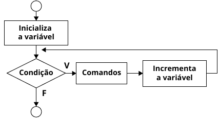

# Algoritmos e Programação Estruturada

APE-U2S3

## Estrutura de repetição usando `for`



## Um contador


```text/x-csrc
#include <stdio.h>

int main() {
    int cont;

    for (cont = 1; cont < 11; cont++) {
        printf("%d, ", cont);
    }
}
```

    1, 2, 3, 4, 5, 6, 7, 8, 9, 10, 

## Dois contadores


```text/x-csrc
#include <stdio.h>

int main() {
    int x, y;

    for (x = 3, y = 7; (x + y) <= 30; x++, y++) {
        printf("%d, ", x + y);
    }
}
```

    10, 12, 14, 16, 18, 20, 22, 24, 26, 28, 30, 

## Três contadores independentes


```text/x-csrc
#include <stdio.h>

int main() {
    int x, y;

    for (x = 10, y = 0; x >= 0 && y <= 10; x--, y++) {
        printf("(%d, %d), ", x, y);
    }
}
```

    (10, 0), (9, 1), (8, 2), (7, 3), (6, 4), (5, 5), (4, 6), (3, 7), (2, 8), (1, 9), (0, 10), 

## `for` e caracteres


```text/x-csrc
#include <stdio.h>

int main() {
    char c;

    for (c = 'a'; c <= 'z'; c++) {
        printf("%c, ", c);
    }
}
```

    a, b, c, d, e, f, g, h, i, j, k, l, m, n, o, p, q, r, s, t, u, v, w, x, y, z, 

## Contagem regressiva


```text/x-csrc
#include <stdio.h>

int main() {
    int contador;

    printf("Digite um numero para contagem regressiva:");
    scanf("%d", & contador);
    for ( ; contador >= 1; contador--) {
        printf("%d, ", contador);
    }
}
```

    Digite um numero para contagem regressiva:

     10


    10, 9, 8, 7, 6, 5, 4, 3, 2, 1, 

## Usando `break` para sair do laço


```text/x-csrc
#include <stdio.h>

int main() {
    int w;

    for (w = 1; w <= 15; w++) {
        if (w == 8) {
            break;
        }
        printf("%d ", w);
    }
    printf("\nParar a condicao de repeticao w = %d \n", w);
}
```

    1 2 3 4 5 6 7 
    Parar a condicao de repeticao w = 8 


## vetor, `for`, `while`


```text/x-csrc
#23456789 123456789 123456789 123456789 123456789 123456789 123456789 
```


```text/x-csrc
#include <stdio.h>

#define MAX 5

int main() {
    int numero, i, posicao, vetor[MAX];

    printf("Entre com o numero de ate 3 casas diferente de zero, "
           "a ser procurado em um vetor de %d posicoes: ", MAX);
    scanf("%d", & numero);

    // Preenche o vetor com numeros
    for (i = 0; i < MAX; i++) {
        printf("Entre com o numero para a posicao %02d: ", i + 1);
        scanf("%d", & vetor[i]);
    }

    // identifica a posicao do numero lido no vetor de entrada
    posicao = 0;
    while (vetor[posicao] != numero) {
        posicao++;
    }
    printf("Posição encontrada: %d\n", posicao+1);

    // Imprime vetor
    for (i = 0; i < MAX; i++) {
        printf("%03d ", vetor[i]);
    }
    printf("\n ");

    // Imprime espaços até a posição do numero, e em seguida 
    // um "*" sob o numero
    for (i = 0; i < posicao; i++) {
        printf("    ");
    }
    printf("*");
}
```

    Entre com o numero de ate 3 casas diferente de zero, a ser procurado em um vetor de 5 posicoes: 

     5


    Entre com o numero para a posicao 01: 

     1


    Entre com o numero para a posicao 02: 

     2


    Entre com o numero para a posicao 03: 

     3


    Entre com o numero para a posicao 04: 

     5


    Entre com o numero para a posicao 05: 

     4


    Posição encontrada: 4
    001 002 003 005 004 
                 *

## Procura um número ímpar


```text/x-csrc
#include <stdio.h>

int main() {
    int i;

    for (i = 1; i <= 100; i++) {
        if (i == 30) {
            break;
        } else if (i % 2 == 1) {
            continue;
        } else {
            printf("%2d, ", i);
        }
    }
    printf("\nTérmino do laço.\n");
}
```

     2,  4,  6,  8, 10, 12, 14, 16, 18, 20, 22, 24, 26, 28, 
    Término do laço.


## Matrizes


```text/x-csrc
#include <stdio.h>

int main() {
    int linha, coluna, matriz[3][3];

    for (linha = 0; linha < 3; linha++) {
        for (coluna = 0; coluna < 3; coluna++) {
            printf("Digitar os valores da matriz para: "
                   "linha %d, coluna %d: ", linha + 1, coluna + 1);
            scanf("%d", & matriz[linha][coluna]);
        }
    }

    printf("Veja a sua Matriz\n");
    for (linha = 0; linha <= 2; linha++) {
        for (coluna = 0; coluna < 3; coluna++)
            printf("%d\t", matriz[linha][coluna]);
        printf("\n\n");
    }
}
```

    Digitar os valores da matriz para: linha 1, coluna 1: 

     1


    Digitar os valores da matriz para: linha 1, coluna 2: 

     2


    Digitar os valores da matriz para: linha 1, coluna 3: 

     3


    Digitar os valores da matriz para: linha 2, coluna 1: 

     4


    Digitar os valores da matriz para: linha 2, coluna 2: 

     5


    Digitar os valores da matriz para: linha 2, coluna 3: 

     6


    Digitar os valores da matriz para: linha 3, coluna 1: 

     7


    Digitar os valores da matriz para: linha 3, coluna 2: 

     8


    Digitar os valores da matriz para: linha 3, coluna 3: 

     9


    Veja a sua Matriz
    1	2	3	
    
    4	5	6	
    
    7	8	9	
    


## Quadrado mágico

- é caracterizado por uma tabela quadrada em que a soma de cada coluna, de cada linha e das duas diagonais são iguais


```text/x-csrc
#include <stdio.h>

int main() {
    int Matriz[31][31], i, j, ordem = 0, quadrado_da_ordem = 0,
        linha = 0, coluna = 0, soma = 0;
        
    printf("Qual a ordem do quadrado magico? (deve ser um numero "
            "impar positivo)");
    scanf("%d", & ordem);

    // encerra o programa se a ordem for par
    if (ordem % 2 == 0 || ordem <= 0) {
        printf("Tem que ser numero impar positivo\n");
        return (0);
    }

    quadrado_da_ordem = ordem * ordem;
    printf("Quantidade de números no Quadrado Magico: %d\n",
            quadrado_da_ordem);
            
    // calculo da posicao inicial (onde vai o nro "1"). Quando a 
    // ordem e diferente de 1, sera na penultima coluna e ultima linha
    if (ordem == 1) {
        linha = 0;
        coluna = 0;
    } else {
        linha = ((ordem + 1) / 2) - 1;
        coluna = ordem - 1;
    }

    // Zera a Matriz
    for (i = 0; i < ordem; i++) {
        for (j = 0; j < ordem; j++) {
            Matriz[i][j] = 0;
        }
    }

    //Preenchendo a Matriz com os valores do Quadrado Magico
    for (i = 1; i <= quadrado_da_ordem; i++) {
        Matriz[linha][coluna] = i;
        
        // se estamos na ultima coluna, voltamos a coluna "0", do
        // contrario, vamos uma coluna a frente.
        if (coluna == ordem - 1) {
            coluna = 0;
        } else {
            coluna++;
        }
        
        // se estamos na primeira linha, vamos a ultima coluna
        // (ordem-1), do contrario, vamos uma linha atras
        if (linha == 0) {
            linha = ordem - 1;
        } else {
            linha--; 
        }
        
        // Se a proxima posição ja esta ocupada (e diferente de "0"),
        // devemos ocupar a posicao do lado esquerdo da ultima
        // posicao preenchida. Caso contrario, devemos preencher a
        // posição acima e a direita da ultima posição preenchida.
        if (Matriz[linha][coluna] != 0) {
            if (coluna == 0) {
                coluna = ordem - 2;
            } else {
                coluna = coluna - 2;
            }

            if (linha == ordem - 1) {
                linha = 0;
            } else {
                linha++;
            }
        }
    }

    printf("O quadrado magico de %dx%d é:\n", ordem, ordem);
    
    //Loop de loop para imprimir a Matriz
    for (i = 0; i < ordem; i++) {
        for (j = 0; j < ordem; j++) {
            printf("%03d ", Matriz[i][j]);
        }
        printf("\n");
    }
    
    // Loop para calcular a soma de linhas, colunas
    // e da diagonal principal do Quadrado magico.
    for (i = 0; i < ordem; i++) {
        soma = soma + Matriz[i][i];
    }
    printf("A soma de cada linha, de cada coluna ou da diagonal "
           "principal e: %d", soma);
    return (0);
}
```

    Qual a ordem do quadrado magico? (deve ser um numero impar positivo)

     3


    Quantidade de números no Quadrado Magico: 9
    O quadrado magico de 3x3 é:
    002 007 006 
    009 005 001 
    004 003 008 
    A soma de cada linha, de cada coluna ou da diagonal principal e: 15


```text/x-csrc

```
