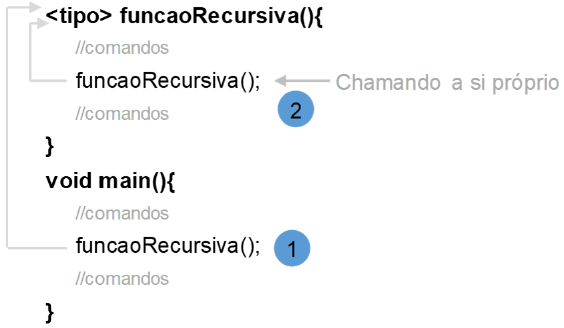
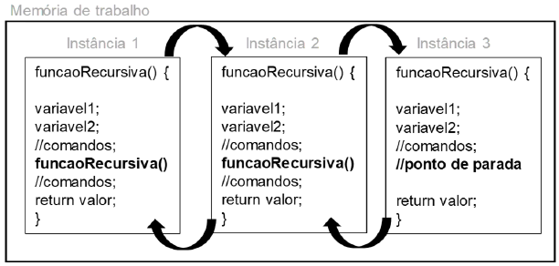
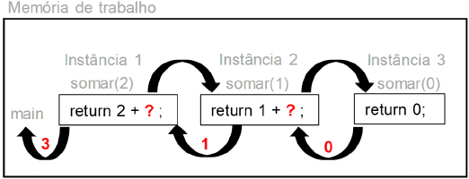
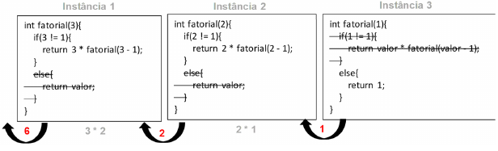
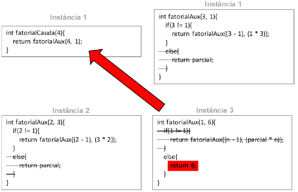

## Algoritmos e Programação Estruturada

APE-U3S3

## Recursividade



- Para cada chamada de função, novos espaços são alocados para variáveis e recursos.
- As variáveis são criadas em instâncias diferentes, e uma não interfere na outra.



Função recursiva para soma:


```text/x-csrc
#include<stdio.h>

int somar(int valor) {
    if (valor != 0) {  // critério de parada
        return valor + somar(valor - 1);  // chamada recursiva
    } else {
        return valor;
    }
}

int main() {
    int n, resultado;

    printf("\n Digite um numero inteiro positivo: ");
    scanf("%d", & n);
    resultado = somar(n);  // primeira chamada da função
    printf("\n Resultado da soma = %d", resultado);
}
```

    
     Digite um numero inteiro positivo: 

     10


    
     Resultado da soma =  55



Mesmo programa, mas sem usar recusão:


```text/x-csrc
#include<stdio.h>

int somar(int valor) {
    int a = 0;

    for(int i = 0; i <= valor; i++) {
        a = a + i;
    }
    return a;
}

int main() {
    int n, resultado;

    printf("\n Digite um numero inteiro positivo: ");
    scanf("%d", & n);
    resultado = somar(n);  // primeira chamada da função
    printf("\n Resultado da soma = %d", resultado);
}
```

    
     Digite um numero inteiro positivo: 

     10


    
     Resultado da soma = 55

- Recursividade pode consumir mais memória.
- Pode simplificar alguns algoritmos.

Fatorial:


```text/x-csrc
#include<stdio.h>

int fatorial(int valor) {
    if (valor != 1) {  // critério de parada
        return valor * fatorial(valor - 1);  // chamada recursiva
    } else {
        return valor;
    }
}

int main() {
    int n, resultado;

    printf("\n Digite um numero inteiro positivo : ");
    scanf("%d", & n);
    resultado = fatorial(n);
    printf("\n Resultado do fatorial = %d", resultado);
}
```

    
     Digite um numero inteiro positivo : 

     10


    
     Resultado do fatorial = 3628800



## Recursividade em cauda


```text/x-csrc
#include<stdio.h>

int fatorialAux(int n, int parcial) {
    if (n != 1) {
        return fatorialAux((n - 1), (parcial * n));
    } else {
        return parcial;
    }
}

int fatorialCauda(int valor) {
    return fatorialAux(valor, 1);
}

int main() {
    int n, resultado;

    printf("\n Digite um numero inteiro positivo : ");
    scanf("%d", & n);
    resultado = fatorialCauda(n); //fazendo a primeira chamada da função
    printf("\n Resultado do fatorial = %d", resultado);
    return 0;
}
```

    
     Digite um numero inteiro positivo : 

     10


    
     Resultado do fatorial = 3628800




```text/x-csrc

```
