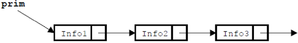
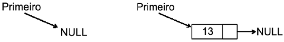
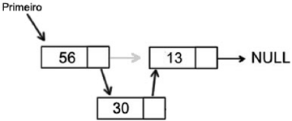
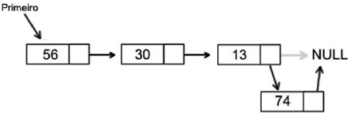
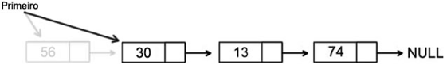
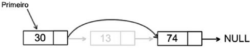
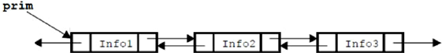
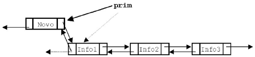
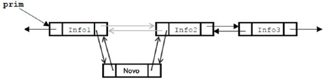
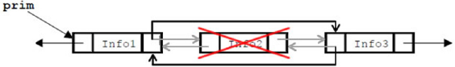

## Algoritmos e Programação Estruturada

APE-U4S1

### Lista ligada




```text/x-csrc
struct lista {
    int info;
    struct lista * prox;
};

typedef struct lista Lista;
```

Exemplo de declaração para criar uma lista em C:


```text/x-csrc
/*Cria a estrutura da lista*/
struct alunos {
    char nome[25];
    struct alunos * prox;
};
```

Função para inicialização:


```text/x-csrc
/* Função para inicialização: retorna uma lista vazia */
Lista * inicializa(void) {
    return NULL;
}
```

Elementos de ligação (ponteiros):


```text/x-csrc
int * ptr; /* sendo um ponteiro do tipo inteiro*/
float * ptr; /* sendo um ponteiro do tipo ponto flutuante*/
char * ptr; /* sendo um ponteiro do tipo caracteres*/
```

### Exemplificando


```text/x-csrc
/* Exemplo de uma es trutura da lista declarada para armazenar dados de uma agenda. */
typedef struct lista {
    char * nome; // Declaração de um ponteiro do tipo char
    int telefone;
    struct lista * proximo;
} Dados;
```

### & = "endereço"


```text/x-csrc
int x = 10; // variável
int * p; // ponteiro
p = & x; // ponteiro p aponta para o endereço da variável x
```

### Exemplo de utilização da função malloc( )


```text/x-csrc
char * pnt;
pnt = malloc(2); /* Aloca 2 bytes na memória */
scanf(“%c”, pnt);
```

### Exemplo de programa em C com malloc() e sizeof()

- sizeof() geralmente é implementada para ser executada em tempo de compilação, e não em tempo de execução.


```text/x-csrc
#include <stdio.h>
#include <stdlib.h>

int main() {
    int * p;

    p = (int * ) malloc( sizeof(int) );

    if (!p) {
        printf("Erro de alocacao de memória.");
    } else {
        printf("Memória alocada com sucesso.");
    }
}
```

    Memória alocada com sucesso.

### Primeiro elemento da lista


```text/x-csrc
celula * start;
start = malloc(sizeof(celula));
start -> prox == NULL
```

Exemplo de um trecho de uma função do tipo inteiro, para inserir pacientes com prioridades na lista:


```text/x-csrc
int insere_com_prioridade(Fila * F, Paciente * P) {
    Lista * ptnodo, * aux, * ant;
    ptnodo = (Lista * ) malloc(sizeof(Lista));
}
```

## Aplicações de listas ligadas

### Trecho de código para iniciar uma lista de supermercado


```text/x-csrc
Dados * inicia_listaMerc(char * prod, int numpro) {
    Dados * novo;

    novo = (Dados * ) malloc(sizeof(Dados));

    novo -> prod = (char * ) malloc(strlen(prod) + 1)
    strncpy(novo -> prod, prod, strlen(prod) + 1);
    novo -> numpro = numpro;
    novo -> proximo = NULL;
    return novo;
}
```


```text/x-csrc
void convidados inserirConvid(tipoitem elemento, int & cont) {
    festa * novo, * aux, * aux1;
    aux = inicio;
    auxl = inicio -> prox;

    while (aux1 != NULL) {
        if (strcmp(aux1 -> item.nome, elemento.nome) > 0)
            break;
        aux = aux -> prox;
        aux1 = aux1 -> prox;
    }

    if (novo = new(festa) == NULL)
        printf("\nMemoria insuficiente");
    else {
        novo -> prox = aux -> prox;
        aux -> prox = novo;
        novo -> item = elemento;
        cont++;
        printf("\nConvidado inserido com sucesso!");
    }

    if (aux1 == NULL)
        fim = novo;

    return;
}
```

## Operações com listas ligadas

### Inserir um novo elemento no início da lista


```text/x-csrc
Lista * inserir(Lista * l, int i) {
    Lista * novo = (Lista * ) malloc(sizeof(Lista));
    novo -> info = i;
    novo -> prox = l;
    return novo;
}
```



### Criar a lista inicial com alguns elementos


```text/x-csrc
int main() {
    Lista * listaFinal;
    listaFinal = inicializar();
    listaFinal = inserir(listaFinal, 13);
    listaFinal = inserir(listaFinal, 56);
}
```

### Inseir um valor no meio da lista




```text/x-csrc
Lista * inserirPosicao(Lista * l, int pos, int v) {
    int cont = 1;
    Lista * p = l;
    Lista * novo = (Lista * ) malloc(sizeof(Lista));
    while (cont != pos) {
        p = p -> prox;
        cont++;
    }
    novo -> info = v;
    novo -> prox = p -> prox;
    p -> prox = novo;
    return l;
}
```

### Chamada da função principal


```text/x-csrc
listaFinal = inserirPosicao(listaFinal, 1, 30);
```

Assim, no trecho implementado anteriormente, a função inserirPosicao( )
recebe como parâmetros:
- A lista ligada (listaFinal).
- A posição que desejamos inserir – neste caso, a primeira posição.
- O elemento – neste caso, o valor 30.

Inserindo um novo elemento no fim da lista:




```text/x-csrc
Lista * inserirFim(Lista * l, int v) {
    Lista * p = l;
    Lista * novo = (Lista * ) malloc(sizeof(Lista));
    while (p -> prox != NULL) {
        p = p -> prox;
        cont++;
    }
    novo -> info = v;
    novo -> prox = p -> prox;
    p -> prox = novo;
    return l;
}
```

Função principal para chamar a função:


```text/x-csrc
listaFinal = inserirFim(listaFinal, 74);
```

### Remover elementos da lista



### Removendo o elemento do meio da lista




```text/x-csrc
Lista * remove(Lista * l, int v) {
    Lista * anterior = NULL;
    Lista * p = l;
```

WHILE: para procurar o elemento a ser excluído e guardar a posição do anterior no ponteiro criado anteriormente:


```text/x-csrc
while (p != NULL && p -> info != v) {
    anterior = p;
    p = p -> prox;
}
```

A função retorna à própria lista para a função principal, caso o elemento a ser excluído não seja encontrado na lista ligada:


```text/x-csrc
if (p == NULL )
    return l;
```

Essa função também remove o último valor da lista, já que ele armazena o ponteiro do elemento anterior:


```text/x-csrc
if (anterior == NULL) {
    l = p -> prox;
} else {
    anterior -> prox = p -> prox;
}
```

E utilizamos o RETURN da lista para retornar à função principal:


```text/x-csrc
    return l;
}
```

Função principal:


```text/x-csrc
listaFinal = retira(listaFinal,56);
listaFinal = retira(listaFinal,13);
```

### Percorrer a lista ligada

Por ser uma função que vai percorrer toda a lista e de impressão em tela, podemos declará-la como VOID, uma função que não vai retornar valor para a função principal:


```text/x-csrc
void imprimir(Lista * l) {
    Lista * p;
    printf(“Elementos: \n”);
```

Neste trecho, uma condição de repetição FOR percorre a lista e imprime todos os elementos encontrados na lista:


```text/x-csrc
    for (p = l; p != NULL; p = p -> prox) {
        printf(“%d -> “, p -> info);
    }
}
```

 Função principal:


```text/x-csrc
imprimir(listaFinal);
```

## Verificar se um elemento consta na lista ligada

Podemos utilizar o trecho de código a seguir para implementar a função de busca:


```text/x-csrc
Lista * buscar(Lista * l, int v) {
    Lista * p;
```

Criamos uma condição de repetição para procurar na lista o elemento solicitado, passado por parâmetro e até terminar a lista, comparando se o elemento é o que está consultado. Sendo verdadeiro, retorna o ponteiro; caso contrário, retorna NULL:


```text/x-csrc
    for (p = l; p != NULL; p = p -> prox) {

        if (p -> info == v)

            return p;
    }

    return NULL;
}
```

Já para a implementação na função principal, podemos utilizar o seguinte trecho de código para chamar a função e escrever se foi encontrado ou não o elemento. Se o retorno for NULL, será escrito Elemento não encontrado; caso encontre, será escrito Elemento encontrado:


```text/x-csrc
if (busca(listaFinal, 74) == NULL) {
    printf(“\n Elemento não encontrado”);
} else {
    printf(“\n Elemento encontrado”);
}
```

## Lista duplamente ligada




```text/x-csrc
struct Lista {
    int info;

    struct lista * ant;
    struct lista * prox;

};

typedef struct lista Lista;
```

Como na lista ligada simples, também precisamos inicializar a lista duplamente ligada para a utilizarmos após a sua declaração. Uma das possíveis formas de inicialização é criar a função retornando a lista como nula:


```text/x-csrc
/* Função para retornar uma lis ta vazia */
Lista * inicializa(void) {
    return NULL;
}
```

### Adicionar elementos à lista duplamente ligada




```text/x-csrc
Lista * inserir(Lista * l, int i) {
    Lista * novo = (Lista * ) malloc(sizeof(Lista));
    novo -> info = i;
    novo -> prox = l;
    novo -> ant = NULL;
    //Verifica se lista não está vazia
    if (l != NULL)
        l -> ant = novo;
    return novo;
}
```

A chamada para a função dentro da função principal Main pode ser realizada pela linha:


```text/x-csrc
int main() {
    Lista * listaFinal;
    listaFinal = inicializar();
    listaFinal = inserir(listaFinal, 20);
}
```

Inserindo no meio da lista:



Remover elementos da lista duplamente ligada:


```text/x-csrc
Lista * busca(Lista * l, int v) {
    Lista * p;
    for (p = l; p != NULL; p = p -> prox) {
        if (p -> info == v)
            return p;
    }
    return NULL;
}
```

Remoção de um elemento da lista:




```text/x-csrc
Lista * retira(Lista * l, int v) {
    Lista * ant = NULL;
    Lista * p = l;
    while (p != NULL && p -> info != v) {
        ant = p;
        p = p -> prox;
    }
    if (p == NULL)
        return l;
    if (ant == NULL) {
        l = p -> prox;
    } else {
        p -> ant -> prox = p -> prox;
    }
    if (p -> prox != NULL)
        p -> prox -> ant = p -> ant;
    return l;
}
```

### Ordenar a lista duplamente ligada


```text/x-csrc
void Ordena(Lista * l) {
    Lista * p;
    Lista * aux;
    int temp;
    for (p = l; p != NULL; p = p -> prox) {
        for (aux = p -> prox; aux != NULL; aux = aux -> prox) {
            if ((p -> info) > (aux -> info)) {
                temp = p -> info;
                p -> info = aux -> info;
                aux -> info = temp;
            }
        }
    }
}
```

### Função principal Main


```text/x-csrc
printf(“\n Lista Ordenada”);
Ordena(listaFinal);
```
