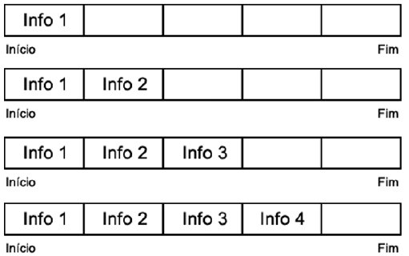
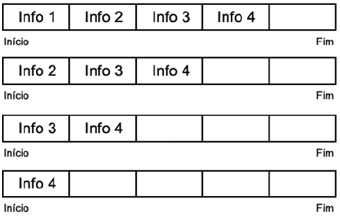
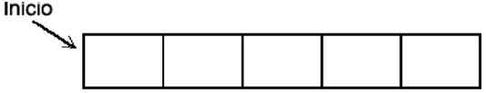
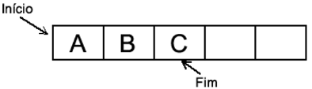
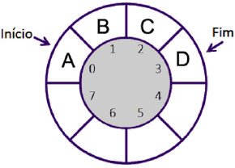

## Algoritmos e Programação Estruturada

APE-U4S3

## Filas

Fila apresenta operações similares às da estrutura de pilha para gerenciamento de uma fila.

Entrada de elemento pelo final da fila:



Saída de elemento pelo início da fila:



### Definir a fila


```text/x-csrc
#define N 100

struct fila {
    int n;
    int ini;
    char vet[N];
};

typedef struct fila Fila;
```

Inicializar:


```text/x-csrc
Fila * inicia_fila(void) {
    Fila * f = (Fila * ) malloc(sizeof(Fila));
    f -> n = 0;
    f -> ini = 0;
    return f;
}
```



Inserção:


```text/x-csrc
void insere_fila(Fila * f, char elem) {
    int fim;
    if (f -> n == N) {
        printf(“A fila es tá cheia.\n”);
        exit(1);
    }
    fim = (f -> ini + f -> n) % N;
    f -> vet[fim] = elem;
    f -> n++;
}
```



Remover:


```text/x-csrc
float remove_fila(Fila * f) {
    char elem;
    if (fila_vazia(f)) {
        printf(“A Fila esta vazia\ n”);
        exit(1);
    }
    elem = f -> vet[f -> ini];
    f -> ini = (f -> ini + 1) % N;
    f -> n--;
    return elem;
}
```


Verifica se está vazia:


```text/x-csrc
int fila_vazia(Fila * f) {
    return (f -> n == 0);
}
```

 Libera a alocação de memória:


```text/x-csrc
void libera_fila(Fila * f) {
    free(f);
}
```

## Filas circulares

São os ponteiros, e não os elementos da fila, que se movem em direção ao início do vetor




```text/x-csrc
/* Vamos definir a constante N com valor de 10 */

#define N 10

struct filacirc {
    /* Criação da es trutura da Fila Circular */
    int tam, ini, fim;

    char vet[N];
};

typedef struct filacirc FilaCirc;

/* Função para inicializar a Fila */
void inicia_fila(FilaCirc * f) {
    f -> tam = 0;
    f -> ini = 1;
    f -> fim = 0;
}

/* Função para inserir na Fila */
void insere_fila(FilaCirc * f, char elem) {
    if (f -> tam == N - 1) {
        /* Verifica se a Fila está completa */
        printf(“A fila esta cheia\ n”);
    } else {
        /* Caso a Fila não esteja completa, inserimos o elemento */
        f -> fim = (f -> fim % (N - 1)) + 1;
        f -> vet[f -> fim] = elem;
        f -> tam++;
    }
}

int fila_vazia(FilaCirc * f) {
    /* Retorna verdadeiro se a Fila estiver vazia */
    return (f -> tam == 0);
}

char remove_fila(FilaCirc * f) {
    if (fila_vazia(f)) {
        /* Verifica se a Fila está vazia */
        printf(“Fila vazia\ n”);
    } else {
        /* Caso a Fila contenha elemento, é removido o primeiro */
        f -> ini = (f -> ini % (N - 1)) + 1;
        f -> tam--;
    }
}
```


```text/x-csrc

```
