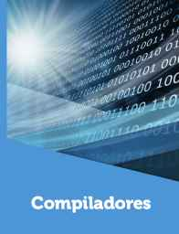
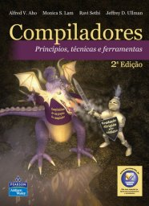
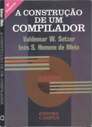
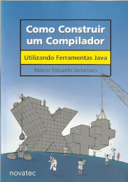

# Compiladores

Website: <https://efurlanm.github.io/teaching/comp/>

&emsp;
&emsp;
&emsp;

- FEDOZZI, R. [Compiladores](http://cm-kls-content.s3.amazonaws.com/201802/INTERATIVAS_2_0/COMPILADORES/U1/LIVRO_UNICO.pdf). 2018.
- AHO, A. V. et al. [Compiladores: princípios, técnicas e ferramentas](https://www.amazon.com.br/Compiladores-princ%C3%ADpios-ferramentas-Alfred-Aho/dp/8588639246). 2008.
- SETZER, V. W.; MELO, I. S. H. [A construção de um compilador](https://drive.google.com/open?id=1MjaJMJs9zEluTe91UWIc__FM6zJY-ccn). 1989.
- DELAMARO, M. [Como Construir um Compilador Utilizando Ferramentas Java](https://sites.icmc.usp.br/delamaro/SlidesCompiladores/CompiladoresFinal.pdf). 2004.
