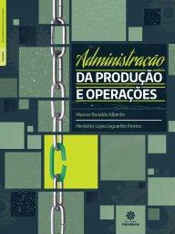

# Gestão da Produção

2º sem 2018

## Ementa

- Introdução à administração da produção e logística. 
- Funções Gerenciais na Administração da Produção. 
- Métodos e técnicas de controle da produção aplicadas às micros, pequenas e médias empresas. 
- Planejamento de operações. 
- Controle de qualidade e estoques. 
- Informatização das técnicas de administração da produção. 
- Sistemas de Distribuição da Produção. 
- Logística integrada à produção.

## Referências

- ALBERTIN, Marcos R.; PONTES, Heráclito LJ. *Administração da produção e operações*. Curitiba: Intersaberes, 2016.

   *Last edited: 2024-11-17*
