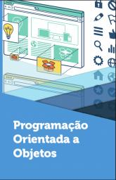
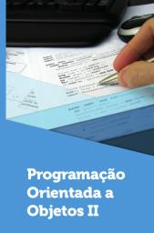
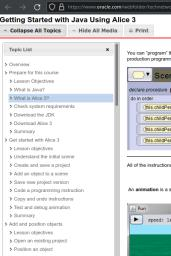
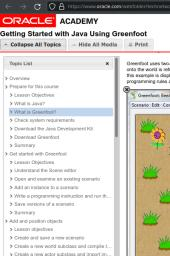

# Linguagem Orientada a Objetos

Web page: <https://efurlanm.github.io/teaching/loo/>

Referências:

&emsp;
&emsp;
&emsp;
&emsp;

- MAITINO NETO, R. Programação orientada a objetos. Londrina: Editora e Distribuidora Educacional S.A, 2018. ISBN 978-85-522-0766-5
- ANDRIJAUSKAS, F. Programação orientada a objetos II. Londrina: Editora e Distribuidora Educacional S.A, 2018. ISBN 978-85-522-1166-2
- SANTOS, R. Introdução à programação orientada a objetos usando java. [S. l.]: Elsevier Brasil, 2013. ISBN 978-85-352-8429-4
- Alice
    - ORACLE. *Getting Started with Java Using Alice 3*. https://www.oracle.com/webfolder/technetwork/tutorials/OracleAcademy/Alice3SelfStudyV2/index.html
    - Carnegie Mellon University. *Alice Website*. https://www.alice.org/
    - BARNUM, B. *This playlist contains a series of Alice 3 programming tutorials*. https://www.youtube.com/playlist?list=PLmpmyPywZ440OmMec0WWu6jqdqCXMd8Td
    - FILITTO, D. *Introdução a lógica de programação orientada a objetos utilizando a ferramenta Alice*. https://www.youtube.com/playlist?list=PLfvOpw8k80WpEULuLEIZIJFakzJ8WUBAC
- Greenfoot
    - ORACLE. *Getting Started with Java Using Greenfoot*. https://www.oracle.com/webfolder/technetwork/tutorials/OracleAcademy/GreenfootSelfStudyV1/obe.html (2023-01-30)
    - University of Kent in Canterbury. *Greenfoot Website*. https://www.greenfoot.org
    - CHANNEL GREENFOOT. https://www.youtube.com/@18km
    - TORRES, A. *Introdução à Criação de Jogos com JAVA utilizando o Greenfoot*. https://youtu.be/y2uQb8JbnRI
