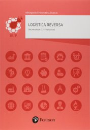

# Logística Reversa

1º sem 2019

## Ementa

- Estudo dos conceitos e fundamentos da Logística Reversa. 
- A Logística Reversa e suas: vertentes: ambiental, socioeconômica e legal. 
- As áreas de atuação da logística e os impactos decorrentes do consumo. 
- Os canais reversos nas cadeias de suprimentos. 
- Organização, planejamento e estratégias para implantação de processos de redes de Logística Reversa. 
- Logística, tecnologias e consciência socioambiental.

## Referências

- IZIDORO, Cleyton. *Logística Reversa*. São Paulo: Pearson Education do Brasil, 2015.

   *Last edited: 2024-11-17*

 Last edited: 2024-11-23 12:22:10
