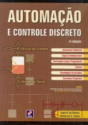
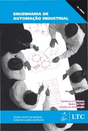
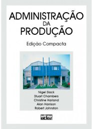
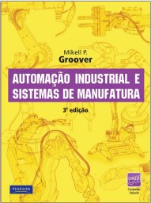

# Organização Industrial e Automação

Website: <https://efurlanm.github.io/teaching/>

Referências:

&emsp;
&emsp;
&emsp;

- SILVEIRA, Paulo Rogério da; SANTOS, Winderson Eugenio dos. *Automação e controle discreto*. 6. ed. São Paulo: Érica, 1999.
- MORAES, Cícero Couto de; CASTRUCCI, Plínio. *Engenharia de automação industrial*. Rio de Janeiro: LTCLivros Técnicos e Científicos S. A. 2001.
- SLACK, Nigel et al. *Administração da Produção*. 2. ed. São Paulo: Atlas, 2002.
- GROOVER, Mikell P. *Automação Industrial e Sistemas de Manufatura*. 3. ed. São Paulo: Pearson Prentice Hall, 2011.
