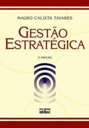

# Planejamento Estratégico da Produção

Website: <https://efurlanm.github.io/teaching/>

- TAVARES, Mauro Calixta. *Gestão estratégica*. 3. ed. São Paulo: Atlas, 2010.
- SLACK, N.; LEWIS, M. *Estratégia de Operações*. 2. ed. Porto Alegre: Bookman, 2009.
- CORREA. H.; GIANESI. I. *Just in Time, MRP II e OPT*: um enfoque estratégico. 2. ed. São Paulo: Atlas, 2011.
