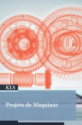

# Projeto de Máquinas

Website: <https://efurlanm.github.io/teaching/>

- LOBO, Y. R. de O.; JÚNIOR, I. E. de O.; ESTAMBASSE, E. C.; SHIGUEMOTO, A. C. G. Projeto de máquinas. Londrina: Editora e Distribuidora Educacional S.A., 2019. ISBN 978-85-522-1466-3
- NORTON, R. L.; BOOKMAN, E.; STAVROPOULOS, K. D.; AGUIAR, J. B. de; AGUIAR, J. M. de; MACHNIEVSCZ, R.; CASTRO, J. F. de. Projeto de Máquinas: Uma Abordagem Integrada. 4ª edição. [S. l.]: Bookman, 2013. ISBN 978-85-8260-022-1
