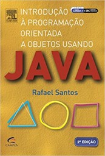

# Programação Orientada a Objetos II

Web page: <https://efurlanm.github.io/teaching/poo/>

Referências:

&emsp;

- ANDRIJAUSKAS, F. Programação orientada a objetos II. Londrina: Editora e Distribuidora Educacional S.A, 2018. ISBN 978-85-522-1166-2
- SANTOS, R. Introdução à programação orientada a objetos usando java. [S. l.]: Elsevier Brasil, 2013. ISBN 978-85-352-8429-4
