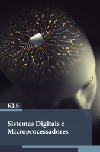
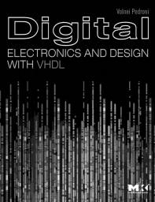
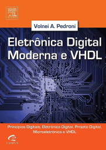

# Sistemas Digitais e Microprocessadores

Web page: <https://efurlanm.github.io/teaching/sdm/>

Referências:

&emsp;
&emsp;

- PERIM, V.; LOPES, G. M. G.; MARTIN, A. A. *Sistemas Digitais e Microprocessadores*. Londrina: Editora e Distribuidora Educacional S.A., 2020.
- PEDRONI, V. *Digital electronics and design with VHDL*. USA: Morgan Kaufmann, 2008. ISBN 978-0080557557.
- PEDRONI, V. *Eletrônica digital moderna e VHDL*. 1ª edição. Rio de Janeiro, RJ: GEN LTC, 2010. ISBN 978-8535234657 (Tradução do original em Inglês).
