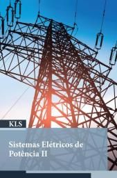
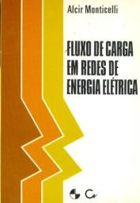
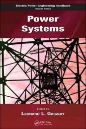

# Sistemas Elétricos de Potência

Website: <https://efurlanm.github.io/teaching/sep/>

Referências:

&emsp;
&emsp;

- SCHINCARIOL, RS; BELIN, PR. Sistemas Elétricos de Potência II. 2019. ISBN 978-85-522-1467-0.
- MONTICELLI, AJ. Fluxo de carga em redes de energia elétrica. 1983. ISBN 9221151484.
- GRIGSBY, LL. Electric Power Engineering Handbook. 2006. ISBN 978-0-8493-9288-7.
