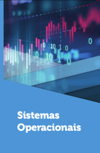

# Sistemas Operacionais

1º sem 2024

## Ementa

- Introdução aos sistemas operacionais. 
- Evolução dos sistemas operacionais. 
- Características e composição dos sistemas operacionais. 
- Processos e Threads. 
- Comunicação entre processos. 
- Escalonamento de processos. 
- Arquivos e sistemas de arquivos. 
- Sistemas de diretórios. 
- Implementação e segurança de sistemas de arquivos. 
- Gerenciamento de dispositivos. 
- Gerenciamento de memória. 
- Swapping: troca de processos. 
- Memória virtual.

## Referências

- BARBOSA, C. da S. *Sistemas Operacionais*. Londrina: EDE SA, 2018. ISBN 978-85-522-1177-8.

   *Last edited: 2024-11-17*
