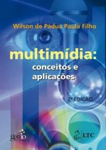

# Tópicos Especiais em Ciências da Computação

Web page: <https://efurlanm.github.io/teaching/tespe/>

Referências:

- PAULA FILHO, Wilson de Padua. *Multimídia: conceitos e aplicações*. Rio de Janeiro: LTC, 2000.

